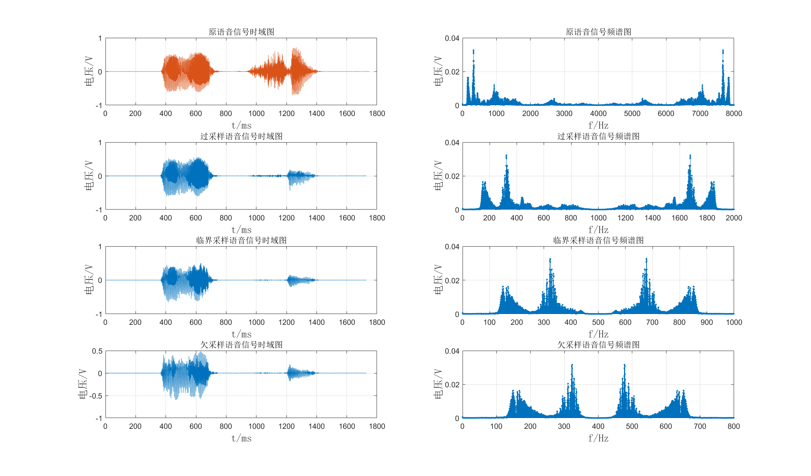
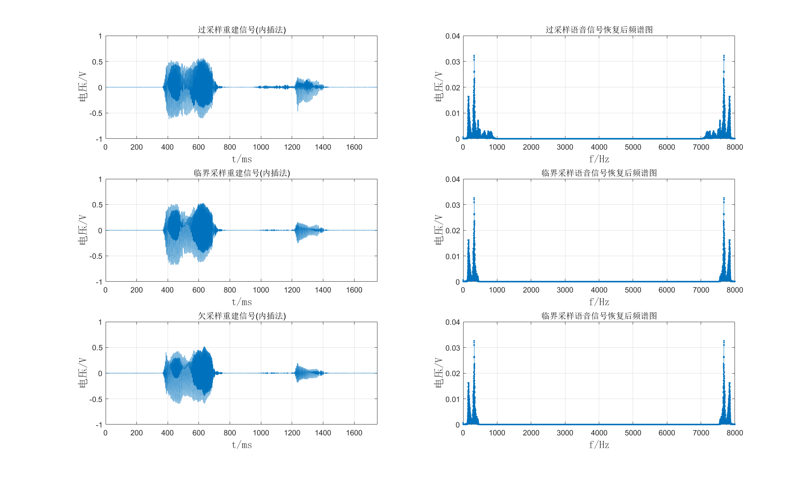
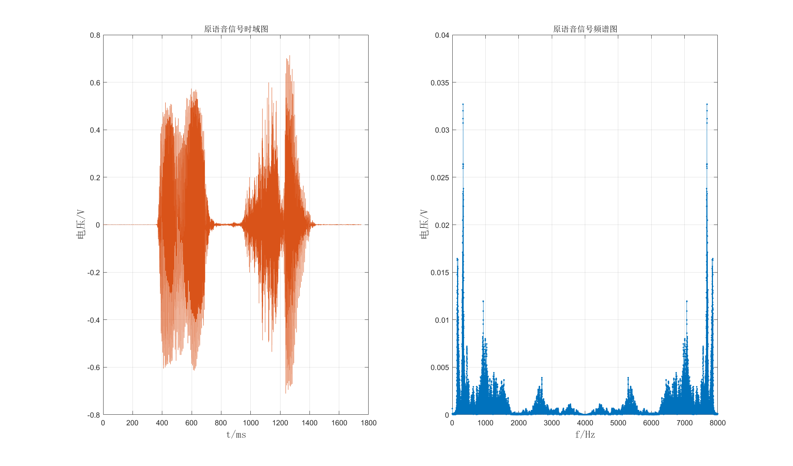
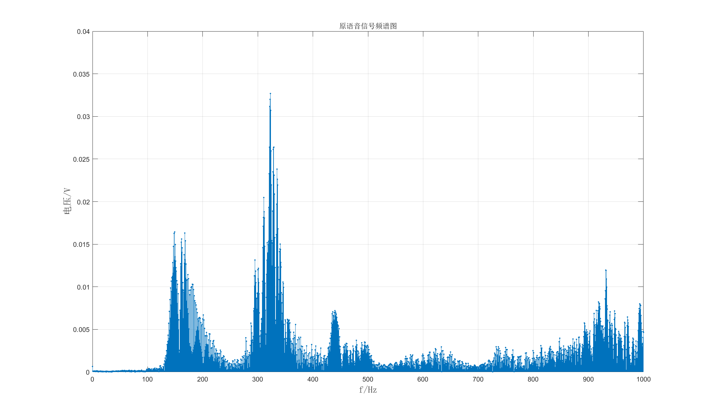
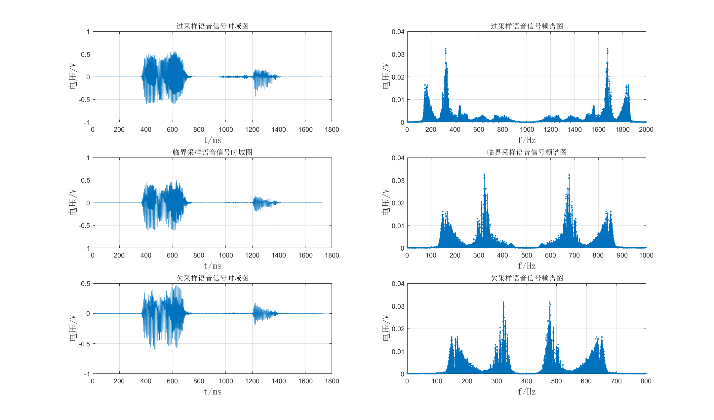
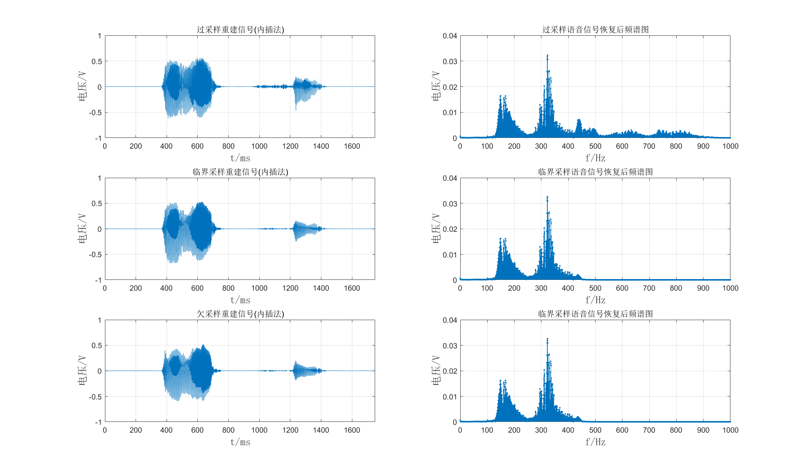

# 
 第一次大作业实验报告
## 一、正弦信号的采样与重建
要求：固定采样频率500 kHz，分别对100 kHz、250 kHz、400 kHz的正弦波信号（幅度，相位自定义）进行采样和重建，分析比较原信号与重建信号的波形。
最终整体结果如下图：

### 1、正弦信号的生成：
三个正弦信号的生成如下图所示：

#### ①代码实现：
&emsp;&emsp;因为被采样信号频率为100,250和400kHz，因此选取时间窗时间范围tscale为6e-5s，并选取采样点数为10000。通过密集点数来对模拟信号进行模拟生成。为了实验方便，取三个信号初始相位均为0，幅度为0.5V。在MATLAB画图时采用了画散点图函数scatter，为了在后续信号恢复时能更清晰地看出点的恢复。
### 2、正弦信号的采样（点图及频谱图）：
三个正弦信号的采样结果如下图所示，左侧三个图为采样后波形，右侧三个图为采样信号的频谱图：

#### ①代码实现：
&emsp;&emsp;由时间窗范围tscale和采样频率f为500kHz可得三个信号的采样点数为30个，因此在0到tscale之间建立采样点数n_point为30的时间序列t，对三个信号进行重新生成，即如以下代码所示：  

    % ==========画采样后的图========== %
    k = 1;
    n_point = (k * tscale) / (1 / 500000);
    
    t = linspace(0, k * tscale, n_point);
    Y1 = A * sin(2 * pi * f1 * t);  % 0.5为振幅。
其中k为时间窗倍率，如果想多采样点数进行频谱生成则增大k值。f1为100kHz频率。矩阵Y1为在t时间间隔矩阵下新生成的函数，也可看作为在f为500kHz下的采样100kHz的函数。250和400kHz的函数采样同上述方法。   
&emsp;&emsp;频谱的生成采用fft函数，输入采样信号矩阵Y1并输出同维矩阵yf1，但此时的yf1并不能直接表示信号的频率，只能表示频率间的相对关系，通过以下变换得到对应频谱函数中的横纵坐标：
  
    % ==========画采样后的频谱图========== %
    fs = 500000;
    
    yf1 = fft(Y1);
    subplot(3, 2, 2);
    realy = 2 * abs(yf1(1 : n_point)) / n_point;
    realf = (0 : n_point - 1) * (fs / n_point);   
其中realf为变换后得到的频谱函数横坐标序列，realy为变换后得到的频谱函数纵坐标序列。具体为什么这样变换我还不是很理解，只能整明这样计算的合理性，该两行变换为借鉴所得。250和400kHz的函数频谱图生成同上述方法。 
#### ②结果分析：
&emsp;&emsp;100kHz采样信号的频谱在100kHz和400kHz处有较大值，其中100kHz为原始正弦信号频率，400kHz为信号频谱负数频率中的-100kHz经过500kHz信号频率向右搬移得到，原理如下图所示(不小心画了个诡异的笑脸)：

&emsp;&emsp;250kHz采样信号的频谱原理同上，因为信号原频率和搬移后频率重合，因此其幅度值大于0.5。  
&emsp;&emsp;500kHz采样信号不满足采样定理，发生频谱混叠，但是因为采样信号只有一个主要频率，因此不明显。
### 3、正弦信号的恢复（内插法重建）：
三个正弦信号的恢复结果如下图所示：

#### ①代码实现：
&emsp;&emsp;采用内插法实现信号恢复（重建），内插法的数学公式如下所示：  
&emsp;&emsp;对以上数学公式进行MATLAB代码实现为： 
 
    % ==========恢复波形========== %
    %原理(内插法): y(t)=Σx(n)*sinc((t-nTs)/Ts)
    n_point = (k * tscale) / (1 / 500000);  % 采样点数
    ts = 1 / fs;  % 采样时间间隔
    to = linspace(0, k * tscale, n_point);
    K = 30;  % 还原后的信号点倍数
    dt = ts / K;  % 还原后的点时间间隔
    ta = 0 : dt : n_point * ts;
    
    figure;
    % =====信号1===== %
    y_recover1 = zeros(length(ta), 1);  % 恢复信号y，先建立一个0矩阵，从0到1，时间间隔为dt
    for t = 0 : length(ta) - 1  % 求过采样后的每个值
    	for m = 0 : length(to) - 1  % 累加sinc与原函数对应点的积
    		y_recover1(t + 1) = y_recover1(t + 1) + Y1(m + 1) * sinc((t * dt - m * ts) / ts);
    	end
    end

其中外循环为求得恢复信号的序列的幅度值，内循环为对内插函数中原信号和抽样信号相乘的累加操作。t序列即为恢复信号中的时间序列t，m序列为原500kHz采样的周期序列，ts为500kHz采样信号的时间间隔（即对应内插公式中的大写周期T），dt为恢复信号的时间间隔。用ts除以K得到dt意思为恢复信号的点之间的间隔要比原采样信号的点时间间隔小30倍，即内插30个点。Y1为采样信号函数（对应公式中的     ）， y_recover为恢复信号函数。
#### ②结果分析：
&emsp;&emsp;经过抽样函数矩形框低通滤波器之后，100kHz的过采样信号被很好地还原，滤除了高频的400kHz；250kHz的临界采样信号，被还原的同时，通过整体来看，可以看出其每个波峰最高点连成的线又形成了一个新的低频正弦信号，这个在频谱图上是没有看到的，在和其他人交流时，发现均碰到这个问题，我感到很疑惑；400kHz的欠采样信号在经过低通滤波器后滤除了400kHz左右的信号，只保留了因频谱搬移得到的100kHz信号，但是其频率小于100kHz，被滤除的频率也略大于400kHz，这个问题我也仍没有解决。
# 二、语言信号的采样与重建
要求：采集一段音频信号，分别用欠采样、临界采样和过采样对信号进行重采样，并重建原音频信号，分析比较重建信号与原信号的差别。  
最终整体结果如下图：

### 1、语音信号的生成：
语音信号的时域和频域图如下图所示：

#### ①代码实现：
&emsp;&emsp;通过audioread函数读取.wav语音信号文件。其他处理方式同前正弦信号。
#### ②结果分析：
&emsp;&emsp;由上图可见在0到8000Hz范围内，信号频谱关于4000Hz对称，且能量主要集中在1000Hz以下，因为人声信号的频率主要在0到600Hz。因此取窗范围为0到1000Hz，如下图所示：

由图可见，信号频率能量的主要范围在300Hz左右，此范围为男中音。
### 2、语音信号的采样：
由上图可知，设语音信号的频率主要在0到500Hz，因此设采样率为2000Hz时为过采样，1000Hz时为临界采样，800Hz时为欠采样。经过过采样，临界采样和欠采样后的时域和频域图如下图所示：

#### ①代码实现：
&emsp;&emsp;通过decimate函数减少采样倍率，在保持总时间不变的前提下减少采样点数。因此2000Hz，1000Hz和800Hz的减少倍率分别为4，8和10。相关代码如下所示：  

    % ==========减少采样率后的信号========== %
    % 人的语音信号频率在0到600Hz之间，从原信号频谱可以看出信号能量在100到500Hz之间，因此以下取采样率为2000Hz为过采样，1000Hz为临界采样，800Hz为欠采样。
    % =====过采样===== %
    x1 = decimate(x, 4);
    t1 = decimate(t, 4);
    fs1 = fs / 4;
    subplot(3, 2, 1);
    plot(t1 .* 1000, x1);
分别要对时间序列和幅值序列进行倍减。
#### ②结果分析：
&emsp;&emsp;从时域角度看，曲线数目随采样率的减少而不断减少；从频域角度看，频谱在不断重叠。在欠采样信号中，混叠频率已经进入了声音的有效频率500Hz内，即发生了频谱的混叠。
### 3、语音信号的恢复（内插法重建）：
三种采样信号的恢复结果如下图所示：

#### ①代码实现：
&emsp;&emsp;同样采用内插法实现信号恢复，原理方法和代码与正弦信号的相同，相关代码如下：   

    % ==========减少采样率后的信号恢复========== %
    f = 8000;
    f1 = 2000;
    f2 = 1000;
    f3 = 800;
    tscale = 1;
    
    % =====过采样===== %
    n_point = 14000 / 4;  % 采样点数
    ts = 1 / f1;  % 采样时间间隔
    to = linspace(0, tscale, n_point);
    K = 4;  % 还原后的信号点倍数
    dt = ts / K;  % 还原后的点时间间隔
    ta = 0 : dt : n_point * ts;
    y_recover1 = zeros(length(ta), 1);  % 恢复信号y，先建立一个0矩阵，从0到1，时间间隔为dt
    
    for t = 0 : length(ta) - 1  % 求过采样后的每个值
    for m = 0 : length(to) - 1  % 累加sinc与原函数对应点的积
    y_recover1(t + 1) = y_recover1(t + 1) + x1(m + 1) * sinc((t * dt - m * ts) / ts);
    end
    end
相关变量的含义也与之前相同。
#### ②结果分析：
&emsp;&emsp;

