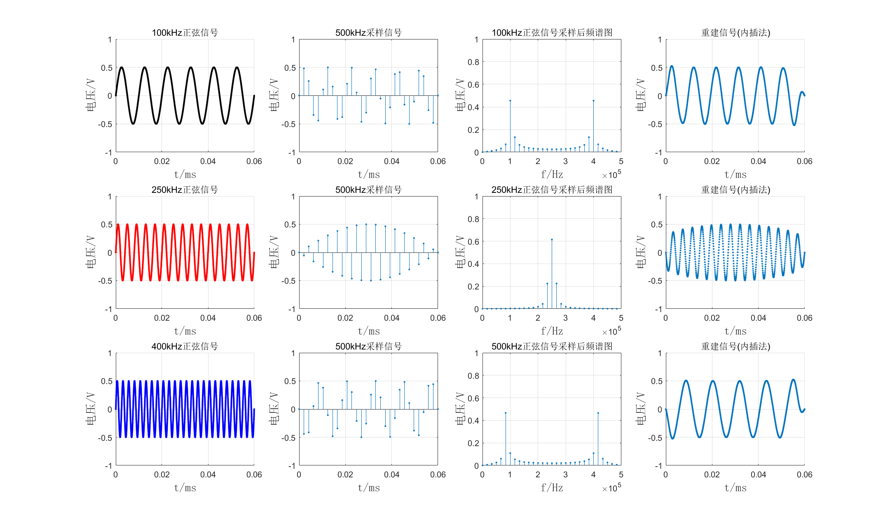
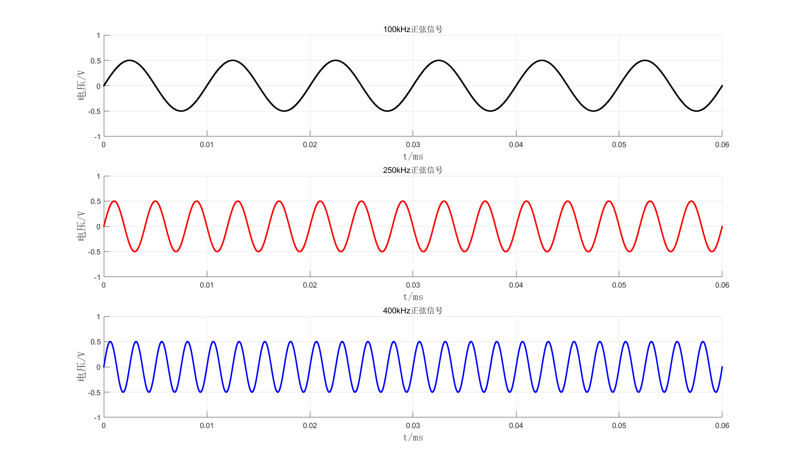
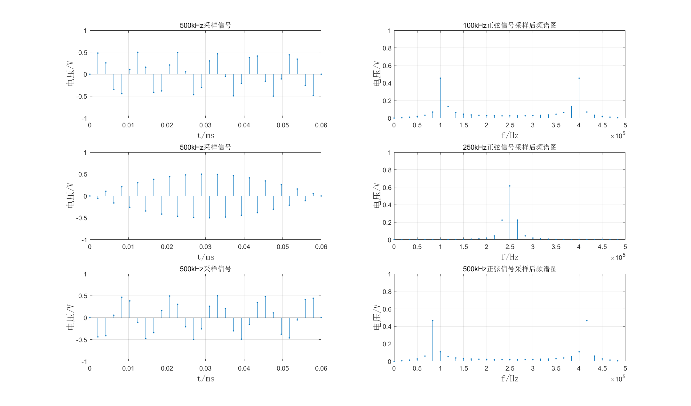
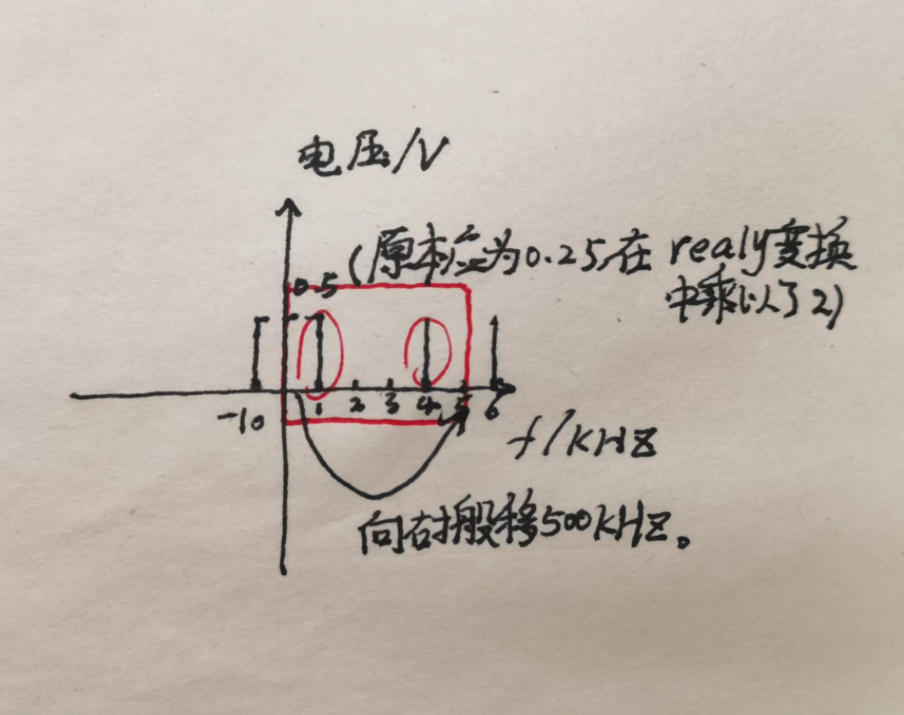
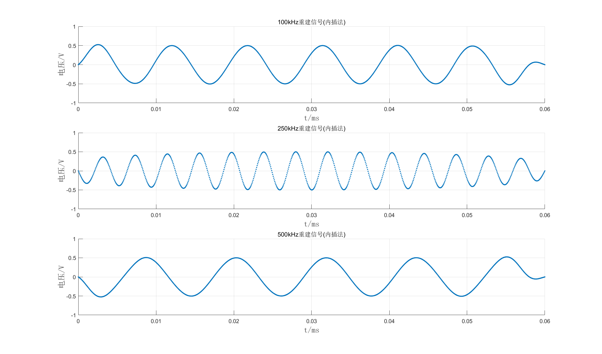

# 
 第一次大作业实验报告
## 一、正弦信号的采样与重建
要求：固定采样频率500 kHz，分别对100 kHz、250 kHz、400 kHz的正弦波信号（幅度，相位自定义）进行采样和重建，分析比较原信号与重建信号的波形。
最终整体结果如下图：

### 1、正弦信号的生成：
三个正弦信号的生成如下图所示：

#### ①代码实现：
&emsp;&emsp;因为被采样信号频率为100,250和400kHz，因此选取时间窗时间范围tscale为6e-5s，并选取采样点数为10000。通过密集点数来对模拟信号进行模拟生成。为了实验方便，取三个信号初始相位均为0，幅度为0.5V。在MATLAB画图时采用了画散点图函数scatter，为了在后续信号恢复时能更清晰地看出点的恢复。
### 2、正弦信号的采样（点图及频谱图）：
三个正弦信号的采样结果如下图所示，左侧三个图为采样后波形，右侧三个图为采样信号的频谱图：

#### ①代码实现：
&emsp;&emsp;由时间窗范围tscale和采样频率f为500kHz可得三个信号的采样点数为30个，因此在0到tscale之间建立采样点数n_point为30的时间序列t，对三个信号进行重新生成，即如以下代码所示：  

    % ==========画采样后的图========== %
    k = 1;
    n_point = (k * tscale) / (1 / 500000);
    
    t = linspace(0, k * tscale, n_point);
    Y1 = A * sin(2 * pi * f1 * t);  % 0.5为振幅。
其中k为时间窗倍率，如果想多采样点数进行频谱生成则增大k值。f1为100kHz频率。矩阵Y1为在t时间间隔矩阵下新生成的函数，也可看作为在f为500kHz下的采样100kHz的函数。250和400kHz的函数采样同上述方法。   
&emsp;&emsp;频谱的生成采用fft函数，输入采样信号矩阵Y1并输出同维矩阵yf1，但此时的yf1并不能直接表示信号的频率，只能表示频率间的相对关系，通过以下变换得到对应频谱函数中的横纵坐标：
  
    % ==========画采样后的频谱图========== %
    fs = 500000;
    
    yf1 = fft(Y1);
    subplot(3, 2, 2);
    realy = 2 * abs(yf1(1 : n_point)) / n_point;
    realf = (0 : n_point - 1) * (fs / n_point);   
其中realf为变换后得到的频谱函数横坐标序列，realy为变换后得到的频谱函数纵坐标序列。具体为什么这样变换我还不是很理解，只能整明这样计算的合理性，该两行变换为借鉴所得。250和400kHz的函数频谱图生成同上述方法。 
#### ②结果分析：
&emsp;&emsp;100kHz采样信号的频谱在100kHz和400kHz处有较大值，其中100kHz为原始正弦信号频率，400kHz为信号频谱负数频率中的-100kHz经过500kHz信号频率向右搬移得到，原理如下图所示(不小心画了个笑脸)：

&emsp;&emsp;250kHz采样信号的频谱原理同上，因为信号原频率和搬移后频率重合，因此其幅度值大于0.5。  
&emsp;&emsp;500kHz采样信号不满足采样定理，发生频谱混叠，但是因为采样信号只有一个主要频率，因此不明显。
### 3、正弦信号的恢复（内插法重建）：
三个正弦信号的恢复结果如下图所示：

#### ①代码实现：
&emsp;&emsp;采用内插法实现信号恢复（重建），内插法的数学公式如下所示：

